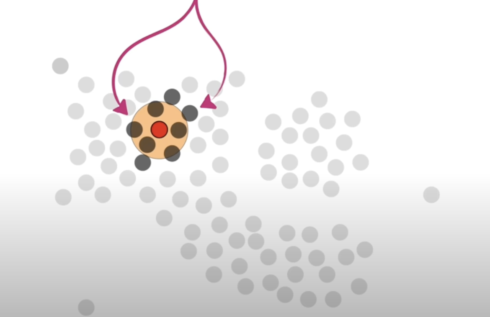
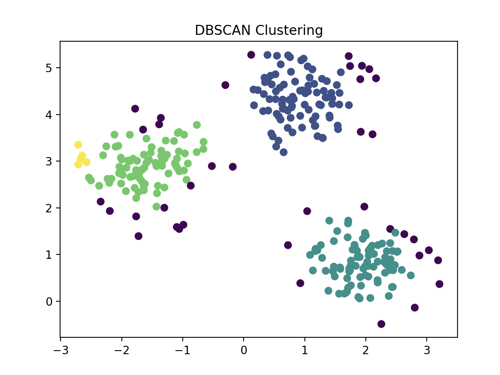
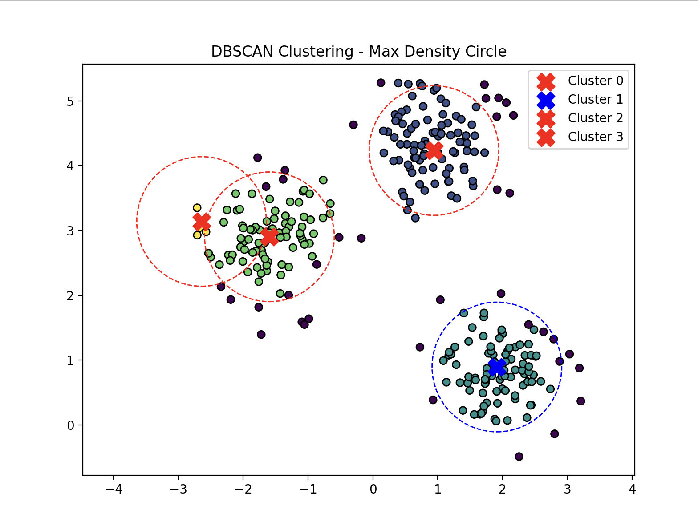
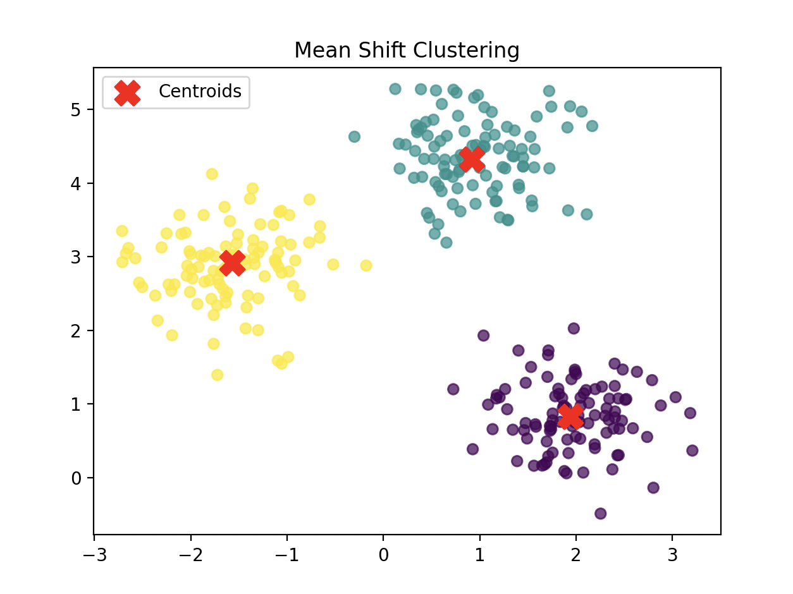
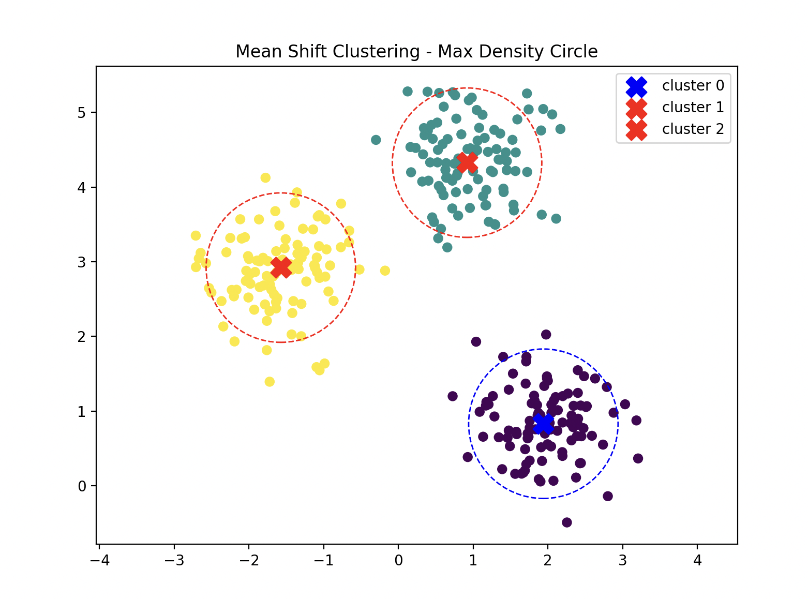

# Max Density Circle

## Problem Statement

**Given:**

- A continuously updated set of 2D points $P = \{p_1, p_2, \dots, p_n\}$ representing the locations (latitude, longitude) of people.
- A fixed radius $r = 100$  meters.

**Objective:**

- Continuously identify the coordinate $c$ such that the circle of radius 100 m centred at $c$contains the maximum number of points from P. The solution must be updated in near real time as new points are added (or removed).

## DBSCAN (Density Based Spatial Clustering of Applications with Noise)

- Clustering algorithm used in ML to partition data into clusters based on their distance to other points.
- Effective at identifying and removing noise (outliers) in a data set.
- Complexity depends on how the nearest neighbour search is implemented.
    - Brute Force Search: $O(n^2)$
    - Tree (k-dimensional tree, ball tree, r-tree): $O(n \: logn)$
    - scikit-learn allows diff searching algorithms
- Key parameters:
    - eps: radius of the “neighbourhood”
    - MinPts: minimum # of points required within the eps radius to be considered as a core point.
- If esp is too high ⇒ a lot of points are considered as 1 cluster
- If esp is too low ⇒ points may be divided in to too many clusters and a lot of them could be considered as outliers.
- If minPts is too high ⇒ cut off is too high so there might be less clusters and a lot of outliers.
- If minPts is too low ⇒ outliers can be considered as clusters

### Procedure

1. Parameter: radius and the min. neighbour points

2. Determine if this point is a core point or not
    - if the radius was 10m and the min neighbour points was 4, a point that has at least 4 other points within the 10m radius circle (can be touching the circle, doesn’t have to be fully inside), it is considered a core point.

    <p align="center">
        
        
    </p>

3. Randomly pick a core point and put it into cluster 1. And in the neighbour points, if there are other core points, put them into cluster 1 as well. Do not include the non core points. Repeat until there are no more core points that can be extended to.

<p align="center">
        
    </p>


4. Add the non core points that are neighbours of the core points that are classified as cluster 1. 
    <p align="center">
        
        
    </p>

5. Other core points that was not “connected” to the core points classified as cluster 1 becomes a new cluster, ie cluster 2. Repeat the step until there are no more core points left.
    <p align="center">
        
    </p>

6. After grouping with the core points, if there are non core points left, they are classified as outliers.

### Pseudocode

```python
DBSCAN(dataset, eps, MinPts) {
    C = 1 # cluster index
    
    for each unvisited point p in dataset {
        mark p as visited
        
        # find all the points within a distance eps from point p
        Neighbours N = find the neigbouring points of p
        
        if |N| >= MinPts:
            N = N U newN # expand the neigbours (=> add the neigbours neighbour if they're core points)
            if newP is not a member of any cluster:
                add newP to cluster C # here the newP is the neighbours)
    }
}
```
<details>
  <summary>Algorithm Implementation with Python</summary>

```python
import numpy as np

def find_neighbors(data, point_idx, eps):
    neighbors = []
    for i in range(len(data)):
        if np.linalg.norm(data[point_idx] - data[i]) <= eps:
            neighbors.append(i)
    return neighbors

def dbscan(data, eps, min_pts):
    clusters = [-1] * len(data)
    cluster_id = 0

    for i in range(len(data)):
        if clusters[i] != -1:
            continue

        neighbors = find_neighbors(data, i, eps)

        if len(neighbors) < min_pts:
            clusters[i] = 0
            continue

        cluster_id += 1
        clusters[i] = cluster_id
        queue = neighbors

        while queue:
            j = queue.pop(0)

            if clusters[j] == 0:  
                clusters[j] = cluster_id

            if clusters[j] != -1:
                continue

            clusters[j] = cluster_id
            new_neighbors = find_neighbors(data, j, eps)

            if len(new_neighbors) >= min_pts:
                queue.extend(new_neighbors)

    return clusters

data = np.array([[1, 2], [2, 2], [3, 2], [8, 7], [8, 8], [25, 80]])
eps = 2
min_pts = 2

clusters = dbscan(data, eps, min_pts)
print(clusters)
```
</details>

## Clustering


```python
import matplotlib.pyplot as plt
from sklearn.cluster import DBSCAN
from sklearn.datasets import make_blobs

X, _ = make_blobs(n_samples=300, centers=3, cluster_std=0.5, random_state=0)

db = DBSCAN(eps=0.3, min_samples=5).fit(X)
labels = db.labels_

print(labels)

plt.scatter(X[:, 0], X[:, 1], c=labels, cmap='viridis', edgecolors='k')
plt.title("DBSCAN Clustering")
plt.show()
```

### Questions

- Seems useful for clustering, but how does this help us find the coord of the circle?
    - DBSCAN can find the dense area, but it doesn’t specifically return the coord that has the most points within a given radius (= the problem statement)
    - ⇒ some modifications are needed:
        1. Determine the core points using DBSCAN and check each core points
        2. Multiple DBSCAN procedures with different eps values (50m, 10m, 100m)
        3. Group with DBSCAN and local search (select the centre point, select centre point and compare, etc.)

### Find the Densest Cluster

- Calculates the centre point of each cluster then counts the number of points inside.



```python
import numpy as np
import matplotlib.pyplot as plt
from sklearn.cluster import DBSCAN
from sklearn.datasets import make_blobs
from scipy.spatial import distance

X, _ = make_blobs(n_samples=300, centers=3, cluster_std=0.5, random_state=0)

db = DBSCAN(eps=0.3, min_samples=5).fit(X)
labels = db.labels_

unique_labels = set(labels) - {-1} 
centers = []

for l in unique_labels:
    mask_bool = (labels == l)
    cluster_points = X[mask_bool]

    x_min = np.min(cluster_points[:, 0])
    x_max = np.max(cluster_points[:, 0])
    y_min = np.min(cluster_points[:, 1])
    y_max = np.max(cluster_points[:, 1])

    center_pt = np.array([(x_min + x_max) / 2, (y_min + y_max) / 2])
    centers.append((l, center_pt))

radius = 1
pt_counts = {}

for l, c in centers:
    count = np.sum(distance.cdist([c], X, 'euclidean')[0] <= radius)
    pt_counts[l] = count
    print(f"cluster {l}: {c} [{count}]")

max_dens_cluster = max(pt_counts, key=pt_counts.get)
max_dens_pt = dict(centers)[max_dens_cluster]

plt.figure(figsize=(8, 6))     
plt.scatter(X[:, 0], X[:, 1], c=labels, cmap='viridis', edgecolors='k')

for l, c in centers:
    markerC = 'red' if l != max_dens_cluster else 'blue'
    plt.scatter(c[0], c[1], c=markerC, marker='X', s=200, label=f"Cluster {l}")

    circle = plt.Circle(c, radius, color=markerC, fill=False, linestyle='dashed')
    plt.gca().add_patch(circle)

plt.axis('equal')
plt.title("DBSCAN Clustering - Max Density Circle")
plt.legend()
plt.show()
```

### References

- [https://www.youtube.com/watch?v=RDZUdRSDOok&ab_channel=StatQuestwithJoshStarmer](https://www.youtube.com/watch?v=RDZUdRSDOok&ab_channel=StatQuestwithJoshStarmer)
- [https://www.geeksforgeeks.org/dbscan-clustering-in-ml-density-based-clustering/](https://www.geeksforgeeks.org/dbscan-clustering-in-ml-density-based-clustering/)

## Mean-Shift Clustering

- Also a density based clustering algorithm
- Unlike K-means you don’t have to specify the number of clusters
- Assigns the data points to the clusters iteratively by shifting points towards the mode (⇒ highest density of data points in the region)
- Given a set of data points, the algorithm iteratively assigns each data point towards where the most points are at ⇒ cluster centre
- $O(n^2)$ ⇒ not that efficient
- Key parameters;
    - Bandwidth: neighbourhood size
- Bandwidth is too high ⇒ less clusters that is very huge
- Bandwidth is too low ⇒ too many clusters that are small (may not even be clusters)

### Procedure

1. Initialize centroids. Start with a set of data points as candidate centroids. (all points are centroids) (?? can this be changed?)

2. Shift towards the dense part. For each centroid, compute the mean of all points within a given bandwidth → move the centroid towards this mean. Repeat until it converges (similar to previous point).
    <p align="center">
        
    </p>

3. Merge close centroids. When they stop moving significantly, similar ones are merged.

4. Assign points to clusters (each convergence is a corresponding cluster). Each data point is assigned to the closest centroid.
    <p align="center">
        
    </p>

### Clustering




```python
import matplotlib.pyplot as plt
from sklearn.cluster import MeanShift, estimate_bandwidth
from sklearn.datasets import make_blobs

X, _ = make_blobs(n_samples=300, centers=3, cluster_std=0.5, random_state=0)

bandwidth = estimate_bandwidth(X, quantile=0.2, n_samples=100)

ms = MeanShift(bandwidth=bandwidth)
ms.fit(X)
labels = ms.labels_
cluster_centers = ms.cluster_centers_

plt.scatter(X[:, 0], X[:, 1], c=labels, cmap='viridis', alpha=0.7)
plt.scatter(cluster_centers[:, 0], cluster_centers[:, 1], c='red', marker='X', s=200, label="Centroids")
plt.legend()
plt.title("Mean Shift Clustering")
plt.show()
```

### Find the Densest Cluster



```python
import numpy as np
import matplotlib.pyplot as plt
from sklearn.cluster import MeanShift, estimate_bandwidth
from sklearn.datasets import make_blobs
from scipy.spatial import distance

X, _ = make_blobs(n_samples=300, centers=3, cluster_std=0.5, random_state=0)

bandwidth = estimate_bandwidth(X, quantile=0.2, n_samples=100)
ms = MeanShift(bandwidth=bandwidth)
ms.fit(X)
labels = ms.labels_
centers = ms.cluster_centers_

radius = 1
pt_counts = {}

for l, c in enumerate(centers):
    count = np.sum(distance.cdist([c], X, 'euclidean')[0] <= radius)
    pt_counts[l] = count
    print(f"cluster {l}: {c} [{count}]")

max_dens_cluster = max(pt_counts, key=pt_counts.get)
max_dens_pt = centers[max_dens_cluster]

plt.figure(figsize=(8, 6))
plt.scatter(X[:, 0], X[:, 1], c=labels, cmap='viridis')

for l, c in enumerate(centers):
    markerC = 'red' if l != max_dens_cluster else 'blue'
    plt.scatter(c[0], c[1], c=markerC, marker='X', s=200, label=f"cluster {l}")

    circle = plt.Circle(c, radius, color=markerC, fill=False, linestyle='dashed')
    plt.gca().add_patch(circle)

plt.axis('equal')
plt.title("Mean Shift Clustering - Max Density Circle")
plt.legend()
plt.show()
```


### References

- [https://www.youtube.com/watch?v=Evc53OaDTFc&ab_channel=Udacity](https://www.youtube.com/watch?v=Evc53OaDTFc&ab_channel=Udacity)
- [https://www.youtube.com/watch?v=dNANpVZnIfA](https://www.youtube.com/watch?v=dNANpVZnIfA)
- [https://www.geeksforgeeks.org/ml-mean-shift-clustering/](https://www.geeksforgeeks.org/ml-mean-shift-clustering/)
